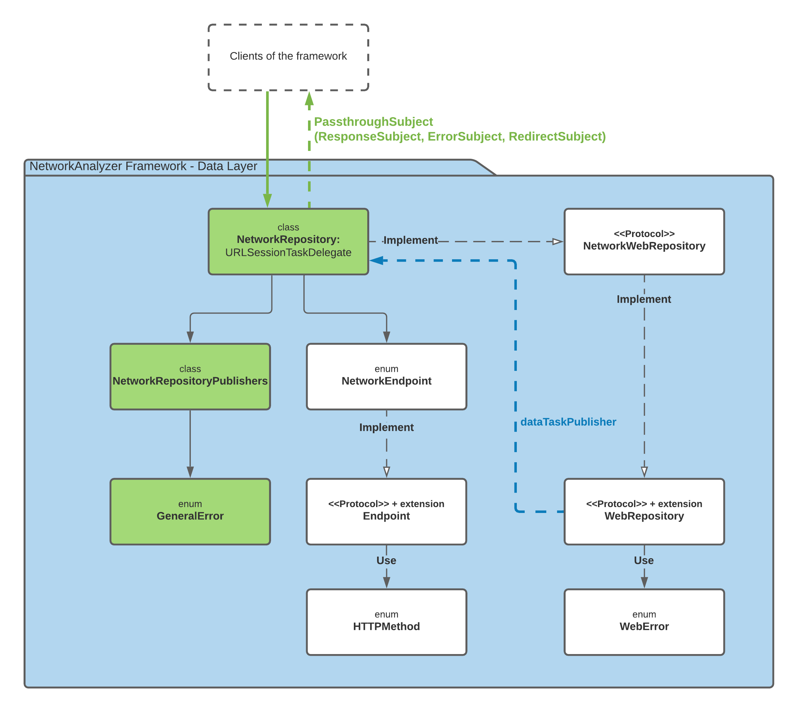

# NetworkAnalyzer Framework
[](https://app.travis-ci.com/github/liort2020/NetworkAnalyzer)


NetworkAnalyzer is a framework developed with [Swift Package Manager](https://swift.org/package-manager/), a tool for managing the distribution of Swift code.
This framework analyzes your URL path and returns:
1. Response data publisher
2. Error publisher
3. Redirects publisher (Visited redirect URLs with status code 301)


## Architecture
This framework is part of the data layer in Clean Architecture
- **Data Layer**
  - `NetworkRepository` - An entry point of this framework, managing our server requests, implements `NetworkWebRepository` protocol, implements `URLSessionTaskDelegate` protocol to display all HTTP redirects, and returning `NetworkRepositoryPublishers`.
  - `NetworkRepositoryPublishers` - Publishers wrapper that contains: response, error, and redirect `PassthroughSubject`.
  - `GeneralError` - The error that our framework can throw.
  - `WebRepository` - Retrieves data from the server using `dataTaskPublisher`.
  - `WebError` - The error that `WebRepository` can throw.
  - `Endpoint` - Prepares the URLRequest to connect to the server (`NetworkEndpoint` implements this protocol).
  - `HTTPMethod` - The HTTP methods that allow in this framework.




## Installation
### System requirement
- macOS 11.0 or later
- iOS 14.0 or later
- tvOS 14.0 or later
- watchOS 7.0 or later

### Install the NetworkAnalyzer framework
#### Option 1 - Add Package Dependency
1. Navigate to your project on Xcode.

2. Add the framework from `File` ➞ `Swift Packages` ➞ `Add Package Dependency...`.

3. Search [https://github.com/liort2020/NetworkAnalyzer](https://github.com/liort2020/NetworkAnalyzer) and press `Next`.

4. Choose branch: `master` and press `Next`.

5. Press `Finish`.

#### Option 2 - CocoaPods (Will be available in the future)
1. Install [`CocoaPods`](https://cocoapods.org) - This is a dependency manager for Swift and Objective-C projects for Apple's platforms. 
You can install it with the following command:

```bash
$ gem install cocoapods
```

2. Navigate to the project directory and add the following text to the `Podfile`:

```ruby
platform :ios, '14.0'
use_frameworks!

target 'YourApp' do
    pod 'NetworkAnalyzer'
end
```


## Basic Usage

1. First, register a service by creating an instance from `NetworkRepository`.
    You need provide:
    - `baseURL` - Base URL for retrieving data from the server (In this example: [http://www.mocky.io/v2](http://www.mocky.io/v2))
    - `maxNumberOfRedirects` - Maximum number of redirect URLs (In this example: 4)

```swift
import NetworkAnalyzer


let baseURL: String = "http://www.mocky.io/v2"
let maxNumberOfRedirects: UInt8 = 4
let networkRepository = NetworkRepository(baseURL: baseURL, maxNumberOfRedirects: maxNumberOfRedirects)
```


2. Retrieve data from the server for a given id:
    - `startRedirectId` - An id to be added to the URL path
    - `networkPublishers` - `NetworkRepositoryPublishers` Publishers wrapper that contain: response, error, and redirect `PassthroughSubject`

```swift
let startRedirectId = "5e0af46b3300007e1120a7ef"
let networkPublishers = networkRepository.get(by: startRedirectId)
```


3. Create subscriptions set,
    here is an example of how to add subscriptions `Set` to a `Class` and remove all subscriptions in the `deinit` method:
```swift
import Combine


private var subscriptions = Set<AnyCancellable>()

deinit {
    subscriptions.removeAll()
}
```


4. Get data from the publishers


* Get data from the framework:
```swift
networkPublishers
    .responseSubject
    .eraseToAnyPublisher()
    .sink { _ in
    } receiveValue: { data in
        print("data: \(data?.description)")
    }
    .store(in: &subscriptions)
```

Console output:
```
data: Optional("[\"hello\": world]")
```


* Get an error from the framework (We need to change baseURL):
```swift
networkPublishers
    .errorSubject
    .eraseToAnyPublisher()
    .sink { completion in
        switch completion {
        case let .failure(error):
            print("error: \(error)")
        case .finished:
            break
        }
    } receiveValue: { _ in }
    .store(in: &subscriptions)
```

Console output:
```
error: invalidURL
```


* Get redirect URLs from the framework:
```swift
networkPublishers
    .redirectSubject
    .eraseToAnyPublisher()
    .sink { _ in
    } receiveValue: { redirectURLRequest in
        print("redirectURL: \(redirectURLRequest.url)")
    }
    .store(in: &subscriptions)
```

Console output:
```
redirectURL: Optional(http://www.mocky.io/v2/5e0af421330000250020a7eb)
redirectURL: Optional(http://www.mocky.io/v2/5e0af415330000540020a7ea)
redirectURL: Optional(http://www.mocky.io/v2/5e0af3ff3300005f0020a7e7)
redirectURL: Optional(https://www.mocky.io/v2/5185415ba171ea3a00704eed)
```


## Troubleshooting
1. An error has occurred on the console: 
    `App Transport Security has blocked a cleartext HTTP (http://) resource load since it is insecure. Use HTTPS instead or add Exception Domains to your app's Info.plist.`"`

    Solution:
    Right-click on `info.plist` ➞ `Open As`  ➞ `Source Code`.
    Add one of the following options to your `info.plist`:
    
    - Option 1: Enable HTTP connections to specific domains (In our example [mocky.io](mocky.io)):
    ```xml
    <key>NSAppTransportSecurity</key>
    <dict>
        <key>NSExceptionDomains</key>
        <dict>
            <key>mocky.io</key>
            <dict>
                <key>NSExceptionAllowsInsecureHTTPLoads</key>
                <true/>
                <key>NSIncludesSubdomains</key>
                <true/>
            </dict>
        </dict>
    </dict>
    ```
    
    - Option 2: Enable HTTP connections to any domain:
    ```xml
    <key>NSAppTransportSecurity</key>
    <dict>
        <key>NSAllowsArbitraryLoads</key>
        <true/>
    </dict>
    ```


## Tests

### Unit Tests
Run unit tests:
1. Navigate to `NetworkAnalyzerTests` target

2. Run the test from `Product` ➞ `Test` or use `⌘U` shortcuts

### Travic CI
This framework integrated with [`Travic CI`](https://travis-ci.com) service that used to build and test software projects and connect to [`GitHub`](https://github.com),
Added a file named `.travis.yml` to configure the [`Travic CI`](https://travis-ci.com) test environment.

Credit: [Setup Travic CI](https://www.youtube.com/watch?v=XMPOns7VIXI)
